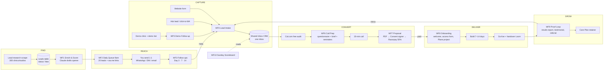

# Client Acquisition System — the full flow

> **Superseded for now by `cowork-kit/`** (2026-09-25): the n8n instance is the
> company's account, so personal client hunting runs in Claude Cowork instead.
> The stages and statuses below still apply; the WF numbers are reference only.

Companion to `client-acquisition-plan.md` (the *what and why*). This file is the
*machine*: every stage from a stranger to a paying, referring client, with the
tool and the n8n workflow behind each step.

Principle: **automate the admin, keep the human parts human.** First messages,
sales calls and proposals stay personal. Everything around them — lists,
drafts, reminders, follow-ups, onboarding, testimonial asks — runs itself.

Bonus: the system runs on your own products (the Lead Research Tool, Shared Inbox CRM and Consent & Contract Signer) and
your own n8n. "My sales pipeline runs on the systems I sell" is itself proof.

---

## 1. The whole flow on one page



Plain-text version:

```
FIND        Lead research ─► Leads table ─► WF1 score + draft opener
REACH       WF2 9am queue ─► YOU send 20 personal msgs ─► WF3 auto follow-ups
CAPTURE     form · ads · demo bot · replies ─► WF4 intake ─► Shared inbox CRM
CONVERT     Cal.com audit ─► WF6 prep + reminders ─► call ─► WF7 proposal ─► Consent signer ─► Razorpay
DELIVER     WF8 onboarding ─► build ─► go-live
GROW        WF9 report + testimonial + referral ─► retainer ─► intros loop back to CAPTURE
MEASURE     WF10 Sunday scoreboard
```

---

## 2. Pipeline stages (one field, one source of truth)

Every lead has exactly one `status`. Every workflow moves it forward.

| Status | Means | Moved by |
|---|---|---|
| `new` | Scraped / added, untouched | Lead research import |
| `ready` | Scored + opener drafted | WF1 |
| `contacted` | First message sent | You (tap "sent" in queue) |
| `followup_1/2/3` | Day 3 / 7 / 14 sent | WF3 |
| `replied` | Any reply | WF3 / WF4 |
| `call_booked` | Audit on the calendar | Cal.com → WF6 |
| `call_done` | Call happened | You |
| `proposal_sent` | Proposal out | WF7 |
| `won` | 50% paid | Razorpay → WF8 |
| `live` | System handed over | You |
| `lost` / `not_now` | Closed — `not_now` is re-contacted in 60 days | You / WF3 |

### Leads table fields
`id · business · owner_name · category · city · website · phone · email ·
instagram · source (lead-research/form/ads/demo/referral/warm) · score (0–100) ·
pain_hint · opener_draft · status · last_touch_at · next_touch_at · channel ·
call_at · proposal_value · won_value · notes`

Start in **Google Sheets or Airtable** (fastest). Move to the Shared Inbox CRM/Postgres once
there are >300 rows or a second person.

---

## 3. The workflows

### WF1 — Enrich & Score  (Schedule: daily 07:00)
1. Read leads with `status = new` (limit 50).
2. HTTP GET the website → strip to text (or reuse the Lead Research Tool's extract).
3. Score: +30 has WhatsApp/phone booking only, +20 no online booking link,
   +15 Instagram active, +15 multiple practitioners, +10 has email, +10 in target city.
4. Claude: *"Write a 3-sentence WhatsApp opener to the owner of {business}.
   Mention one specific thing from their site. Pain: {pain_hint}. Proof: my
   system runs an 11-therapist clinic. End with a question. No emojis, no hype."*
5. Write `score`, `opener_draft`, `status = ready`.

### WF2 — Daily Outreach Queue  (Schedule: weekdays 09:00)
1. Top 20 `ready` leads by score.
2. For each build a `wa.me/<phone>?text=<urlencoded opener>` link + email draft.
3. Send yourself ONE Telegram/email digest: name, why they scored, opener,
   tap-to-open link, and a "✅ sent" button (webhook → `status = contacted`,
   `next_touch_at = +3d`).
> **You** press send on WhatsApp. Never automate cold WhatsApp to strangers —
> it gets the number banned and breaks WhatsApp policy.

### WF3 — Follow-ups & Reply Detection  (Schedule: hourly)
- **Email:** Gmail search for replies from lead addresses → `status = replied`,
  stop sequence, alert you. Otherwise at `next_touch_at` send the next step
  (Day 3 bump + Loom · Day 7 cost-of-no-shows angle · Day 14 close the loop).
  Max 30–40/day, from a separate sending domain, with an opt-out line.
- **WhatsApp/DM:** add the follow-up to tomorrow's WF2 digest as a reminder
  for you to send by hand.
- After Day 14 with no reply → `not_now`, `next_touch_at = +60d`.

### WF4 — Lead Intake  (Webhook — already built: `n8n/lead-intake-workflow.json`)
Sources: website form, Meta lead ads (Facebook Lead Ads trigger), demo sign-ups,
referrals, replies.
1. Validate → dedupe by phone/email (update, don't duplicate).
2. Create/update lead with `source`, `status = replied`.
3. Auto-reply within 60s (WhatsApp template or email): thanks + 90-sec Loom +
   Cal.com audit link.
4. Alert you instantly (Telegram/WhatsApp).
5. If not booked in 24h → one nudge.

### WF5 — Demo Follow-up  (Webhook from the demo clinic)
The demo clinic is the hook: a prospect books a fake slot and gets a real
WhatsApp confirmation (+ a sped-up "reminder" 2 minutes later).
1. Capture name + phone + business (the demo booking form asks for it).
2. Send the demo confirmation → 2 min later the demo "reminder".
3. 30 min later: *"That's exactly what your clients would receive. Want me to
   set this up for {business}? Here's a 20-min slot: {cal link}"*
4. Push into WF4 with `source = demo`.

### WF6 — Call Prep  (Cal.com "booking created" webhook)
1. `status = call_booked`, save `call_at`.
2. Send a 4-question pre-call form: bookings/week · no-shows/week · value of one
   session · tools used today.
3. Reminders 24h + 1h before (the same flow you sell — mention it on the call).
4. 1h before: Claude builds a **call brief** from website + answers:
   estimated monthly no-show loss (no-shows × value × 4), likely offer tier,
   3 questions to ask. Sent to you.

### WF7 — Proposal  (Form you fill after the call, 2 minutes)
Inputs: lead, offer tier, price, go-live date, 3 bullet scope, their numbers.
1. Fill a one-page template (Google Doc → PDF): their problem in their words,
   what gets built, fixed price, 50/50 terms, live date, what's excluded.
2. Send for signature via the **Consent & Contract Signer** (your own tool).
3. On signed → Razorpay payment link for 50%.
4. Unsigned after 48h → nudge; after 7 days → you call.
5. `status = proposal_sent` → `won` on payment.

### WF8 — Onboarding  (Razorpay "payment.captured" webhook)
1. `status = won`, `won_value`.
2. Welcome message + what happens next (day-by-day).
3. Onboarding form: calendar access, WhatsApp Business API / MSG91 account,
   services + durations + prices, FAQs, logo, staff list.
4. Create project in **Plane** from a template (tasks for a 7- or 14-day build).
5. Book kickoff call link.
6. Daily 18:00 "today's progress" message during the build (a 1-line update
   you type; n8n formats and sends).

### WF9 — Proof Loop  (Schedule, keyed off `live` date)
- **Day 7:** automatic results report from their own system — reminders sent,
  bookings made online, confirmations delivered. (Real numbers = real case study.)
- **Day 14:** testimonial request — 3 guided questions (before, after, would you
  recommend) + permission to publish anonymised case study.
- **Day 30:** referral ask — *"Know 2 owners with the same WhatsApp chaos?
  They get the first-client price."* Intros go straight into WF4 with
  `source = referral`.
- **Day 30:** Care Plan offer with the report attached.
- **Monthly:** Care Plan report (uptime, messages sent, fixes made) → renewal.

### WF10 — Sunday Scoreboard  (Schedule: Sunday 18:00)
Counts for the week → sent to you and appended to a sheet:
touches · replies · reply % · calls booked · calls done · proposals · won · ₹ ·
best source · leads going stale (no touch > 7 days).
Rule of thumb: reply < 3% → change the message. Calls not closing → change
offer/price.

---

## 4. Tool stack

| Job | Tool | Cost |
|---|---|---|
| Lead lists | Lead Research Tool (yours) + Google Maps manual | ₹0 |
| CRM / inbox | Google Sheet → Shared Inbox CRM (yours) | ₹0 |
| Automations | n8n (self-hosted) | server you have |
| AI drafts / briefs | Claude API | a few hundred ₹/month |
| Booking calls | Cal.com (free) | ₹0 |
| WhatsApp | Personal business number for 1:1 · MSG91/WhatsApp API for templates & demo | per message |
| Email | Google Workspace on a separate outreach domain | ~₹150/mo/user + domain |
| E-signature | Consent & Contract Signer (yours) | ₹0 |
| Payments | Razorpay payment links | 2% fee |
| Projects | Plane (self-hosted, yours) | ₹0 |
| Videos | Loom free | ₹0 |
| Alerts to you | Telegram bot | ₹0 |

---

## 5. Build order — don't build all ten first

Automating a pipeline with zero leads in it is procrastination. Build only what
the current week needs.

| Week | Build | Why now |
|---|---|---|
| 1 | Leads sheet · **demo clinic + WF5** · Cal.com | The demo is the sales tool |
| 2 | **WF4 intake** live on the site (set `VITE_LEAD_WEBHOOK_URL`) · WF2 digest (even a simple version) | Start outreach, nothing lost |
| 3 | WF1 scoring + Claude openers · WF3 email follow-ups | Volume goes up, follow-ups are where replies come from |
| 4 | WF6 call prep | Calls are starting |
| 5–6 | WF7 proposal + consent signer + Razorpay · WF8 onboarding | First client closes |
| 7+ | WF9 proof loop · WF10 scoreboard | Turn client 1 into clients 2 and 3 |

---

## 6. Show it off

Once WF1–WF9 run, record a 2-minute video of the pipeline itself — lead scraped,
opener drafted, reply captured, call brief, proposal signed, payment → onboarding
fired. Post it, add it as project 06 on the portfolio ("My own client pipeline"),
and offer it as a product to agencies and consultants: **"Client Acquisition
System — done for you."**
